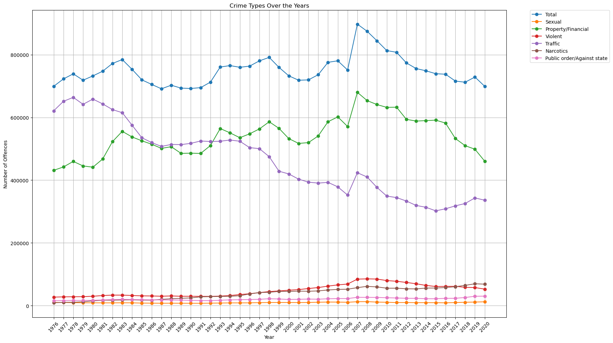

## Exploring Economical Influences on Germany Crime Rates 1976-2020
#### Data Literacy Project W23/24

This project aims to enhance our comprehension of crime, a crucial step in its prevention and prediction, thereby alleviating societal burdens. Focusing on German crime data spanning 1976 to 2020, we utilized clustering methods to unveil relationships among criminal activities. Notably, after identifying a peak in 2007 correlated with the Great Recession, we explored economic factors for improved explainability.

We collected the crime rates from [Destatis](https://www-genesis.destatis.de/genesis//online?operation=table&code=24311-0001&bypass=true&levelindex=1&levelid=1706538901950#abreadcrumb)
and the economic data from [the World Bank](https://data.worldbank.org/country/germany).

## Analysis
### Identifying German Crime Rate Changes (1976-2020)

After manual clustering the 26 types of crime data to have groups for visualization, we explored the changing trends in the German crime rates, specifically we observed a peak in the total crime rates in 2007.

### Clustering the crime types

We used hierarchical clustering with random forest to see which types of crimes have similar trends over the years for an analytical clusterization of our data, we observed the right-hand 4 groups to be the financially related crime types, and we used this cluster as our "Financial" cluster for further analysis with the economic data.

### Correlation with economic indicators 

Then, we used this financial group to see how it correlates with the economic indicators, after taking the year-to-year change difference of the crime rates. As can be seen, we found a 0.42 correlation with financial crimes with inflation.

### Yearly changes in inflation and financial crime 

